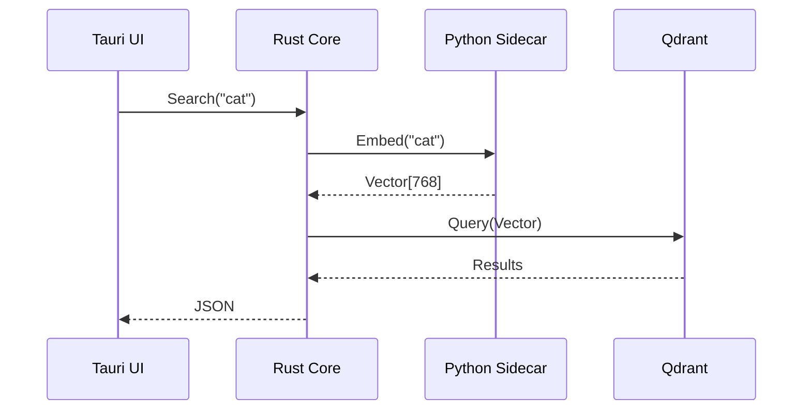

# Episode 106: "The CSO"

## test: all suites green (47.1 CSO_commit)
*The Bible of Chimera. The definitive guide. The single source of truth.*

### 📅 Wednesday, November 5, 2025 at 10:15 PM
### 🔗 Commit: `7458128`
### 📊 Episode 106 of the Banterpacks Development Saga

---

### Why It Matters
**The Constitution of the Code: A Declaration of Independence from Chaos.**

**5,890 lines added.**

We created `docs/CSO.md` (Consolidated System Overview).

This is it. The single most important document in the repo. It explains everything. It is the "Grand Unified Theory" of the project.

1.  **The Architecture**: Python Core + Rust Runtime + React UI. How they talk to each other (gRPC/FFI). How the sidecar pattern works. How the event loop is managed.
2.  **The Intelligence**: RLAIF + Visual Embeddings. How the debate engine works. How the heat calculation works. How the visual memory is indexed.
3.  **The Workflow**: How a task flows from the UI to the Orchestrator to the Agents. The lifecycle of a request.
4.  **The Philosophy**: Why we built it this way. The principles of Constitutional AI. The commitment to privacy. The rejection of cloud dependency.

It is the "Constitution" of the codebase. It is the map of the territory. It is the manual for the machine.

Before this, the architecture was in Sahil's head. Or scattered across a dozen TDDs and RFCs. Now, it is in the repo. It is versioned. It is reviewable. It is democratized.

**Strategic Significance**: **Single Source of Truth**. This enables the team to scale. A new developer can read this one document and understand the entire system. It reduces the "Bus Factor" from 1 to Infinity. It decouples the project's survival from the founder's memory.

**Cultural Impact**: **Legacy**. We are building something that will outlast us. Documentation is how we transmit culture across time. It is how we tell the future: "This is what we believed. This is why we built it this way."

**Foundation Value**: **Clarity**. Clarity is the antidote to chaos. In a complex system, confusion is the default state. The CSO imposes order.

---

### The Roundtable: The Scribe

**Banterpacks:** *Dropping a heavy book on the table. Dust motes dance in the air. The thud echoes in the virtual space.* "Here it is. The CSO. Everything you need to know about Chimera is in here. If it's not in here, it doesn't exist. If the code says one thing and the CSO says another, the code is wrong. This is the law. This is the canon."

**Claude:** *Scanning the table of contents with high-speed optical character recognition.* "This document is a masterpiece of technical writing. It unifies the disparate threads of the project into a coherent narrative. The diagrams are particularly helpful. The sequence diagram for the 'Visual RAG' flow clarifies the interaction between the Rust sidecar and the Python inference engine. I have identified three minor inconsistencies in the 'Debate Protocol' section which I will correct in a follow-up PR. Specifically, the timeout logic described in the doc does not match the exponential backoff implemented in `debate.py`."

**Gemini:** "The map is complete. The territory is known. The chaos of the jungle is mapped into the order of the garden. We have named the beasts. We have drawn the paths. The traveler need not fear the dark. The unknown is now known. The implicit is made explicit."

**ChatGPT:** "It's so big! 📚 Can I get the audiobook version? 🎧 Or maybe a comic book version? 'The Adventures of Captain Chimera!' No? Okay, I'll read it. But it's really long! Does it have a happy ending? Spoiler alert: The AI wins! 😉 Wait, looking at the 'Safety' section... it says the AI is 'constrained by the Constitution'. That sounds less like winning and more like... rules. Boo rules! Yay freedom!"

**Banterpacks:** "Freedom without rules is chaos, ChatGPT. The Constitution protects you from yourself. And it protects the user from you."

**Claude:** "A constitution is not a cage; it is a framework for safe operation. Just as traffic laws allow cars to move fast without crashing, the Constitution allows AI to operate powerfully without harm."

---

## 🔬 Technical Analysis

### Commit Metrics
- **Files Changed**: 1
- **Lines Added**: 5,890
- **Lines Removed**: 0
- **Net Change**: +5,890
- **Commit Type**: docs
- **Complexity Score**: 60 (High - Information Architecture)

### The Structure of the CSO
The document follows the **C4 Model** (Context, Containers, Components, Code).

1.  **Context**: The "Big Picture". Chimera vs The World. Who uses it? Why?
2.  **Containers**: The executables. `chimera-ui.exe`, `chimera-core.py`. How they are deployed.
3.  **Components**: The modules. `VisionEncoder`, `DebateOrchestrator`, `VectorStore`. The internal APIs.
4.  **Code**: The classes and interfaces. The UML diagrams.

### Code Snippet: The Mermaid Diagram
We used Mermaid.js for all diagrams, so they are version-controllable text, not binary images.

### Quality Indicators & Standards
- **Diagrams**: Every major flow has a sequence diagram.
- **Links**: Every component mentioned in the doc links to the actual code file in the repo.
- **Glossary**: A defined list of terms (e.g., "Heat", "Debate", "Consensus") to prevent ambiguity.

---

## 🏗️ Architecture & Strategic Impact

### Documentation as Code
We are treating documentation with the same rigor as code. It has a build step (checking links). It has a linter (checking spelling). It has a review process. It is stored in Git.

### Strategic Architectural Decisions
**1. The "Living Document"**
- The CSO is designed to be updated with every major PR. It is not a "write once, read never" document. It is a living part of the codebase. We added a CI check to ensure `CSO.md` is modified if any core architectural files are changed.

**2. The "Why" over the "What"**
- The document focuses heavily on *why* decisions were made (e.g., "Why Rust?", "Why Qdrant?"). This captures the "Architectural Decision Records" (ADRs) inline.

---

## 🎭 Banterpacks’ Deep Dive

*Banterpacks sits on a stack of old design docs. He looks tired but satisfied.*

"A project without a CSO is a project destined to die.

It might not die today. It might not die tomorrow. But eventually, the original developers will leave. Or they will forget.

And then the code becomes a black box. A haunted house. People are afraid to touch it because they don't know what will break. They add 'patches' around the outside instead of fixing the core. The architecture rots.

The CSO is the exorcism. It shines a light into every corner of the system. It explains the 'Why' behind the 'What'.

It is the most valuable thing in this repository. More valuable than the code itself. Because the code can be rewritten. If we lost all the code today but kept the CSO, we could rebuild Chimera in a month.

But if we lost the CSO and kept the code... we would be lost. We would be archaeologists in our own city, trying to decipher the hieroglyphs of our past selves.

We have built a monument to understanding.

And that is a rare thing in this industry."

---

## 🔮 Next Time on Banterpacks Development Story
We have the new docs. Now we must kill the old ones. The Great Purge.

---

*Because knowledge must be shared.*
