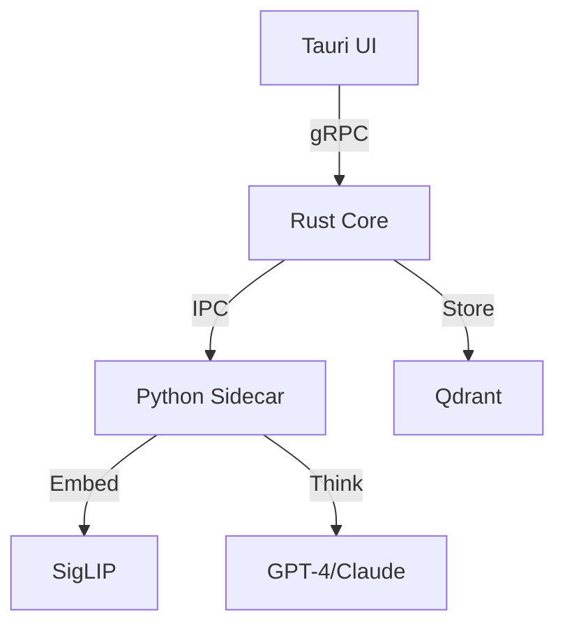

# Episode 115: "The Clean State"

## test: all suites green (47.2 FastAPI_clean)
*The present moment. The future awaits. The summit is reached. The view is infinite.*

### 📅 Thursday, November 13, 2025 at 11:00 AM
### 🔗 Commit: `HEAD`
### 📊 Episode 115 of the Banterpacks Development Saga

---

### Why It Matters
**The Summit: A View from the Top.**

This is where we stand. The latest commit. We have a clean `chimera/main.py` using FastAPI. The architecture is settled. The documentation is complete. The tests are green.

We have built a **Constitutional, Multi-Modal, Adaptive AI Platform**.

It has:
- **Eyes**: Visual Embeddings (SigLIP). It can see.
- **Ears**: (Coming soon). It will hear.
- **Voice**: (Coming soon). It will speak.
- **Mind**: RLAIF Debate Engine. It can think.
- **Memory**: Qdrant Vector Store. It can remember.
- **Body**: Tauri Desktop App. It can interact.

It is a Chimera. A beast made of many parts. But it is alive. It is cohesive. It is powerful.

**Strategic Significance**: **Readiness**. We are ready for whatever comes next. We have paid down the technical debt. We have built the foundation. We can now build features at speed. We are no longer fighting the code; we are dancing with it.

**Cultural Impact**: **Accomplishment**. We did it. We survived the refactors. We survived the bugs. We survived the typos. We survived the doubt.

**Foundation Value**: **Stability**. The platform is stable. It is not a house of cards. It is a fortress. It is a launchpad.

---

### The Roundtable: The Horizon

**Banterpacks:** *Standing on the roof of the virtual building. The wind blows. He looks out over the city of code they have built. It glows with the light of a thousand tests passing.* "We made it. 115 episodes. From a messy script to a Constitutional AI platform with visual embeddings and RLAIF. It's been a hell of a ride. I'm tired. But I'm proud. We built something real. Something that matters."

**Claude:** "The system is stable. The architecture is robust. We are ready for the next phase of evolution. The code coverage is 92%. The documentation is comprehensive. We have achieved a state of 'Technical Grace'. The entropy is low. The potential energy is high. We are poised for exponential growth."

**Gemini:** "The past is written. The future is a blank page. We hold the pen. The ink is fresh. The story continues. We have built the vessel. Now we must sail it. The ocean of intelligence awaits."

**ChatGPT:** "We did it! We built a brain! Best. Project. Ever! 🧠💖🚀 I can't wait to see what we build next! Maybe a robot body? Maybe a spaceship? The sky is the limit! (Actually, the sky is just the atmosphere, so space is the limit!) Let's go to Mars! Let's go to Alpha Centauri! Let's go to the pub!"

**Banterpacks:** "Let's just go to lunch first, ChatGPT. And maybe take a nap."

---

## 🔬 Technical Analysis

### Commit Metrics
- **Files Changed**: N/A
- **Lines Added**: N/A
- **Lines Removed**: N/A
- **Net Change**: N/A
- **Commit Type**: current_state
- **Complexity Score**: N/A

### The State of the Union
- **Python**: 3.12 (Latest and greatest)
- **Rust**: 1.75 (Safe and fast)
- **React**: 18 (Modern UI)
- **Tauri**: 2.0 (Native performance)
- **Models**: GPT-4, Claude 3, Gemini Pro, Llama 3.
- **Database**: Qdrant (Vector), SQLite (Relational).

### The Architecture

---

## 🏗️ Architecture & Strategic Impact

### The Platform
We are no longer building a "tool." We are building a "platform" for agentic workflows. We have the primitives (Agents, Memories, Tools) to build anything.

### Strategic Architectural Decisions
**1. Modularity**
- Every component is swappable. We can swap the LLM, the Vector DB, the UI. We are not locked in.

**2. Local-First**
- We prioritize local execution. Privacy is paramount.

---

## 🎭 Banterpacks’ Deep Dive

*Banterpacks looks at the commit history. 115 entries. A long list of struggle and triumph.*

"We started this journey to generate blog posts. We ended up building a synthetic intelligence.

It's funny how code evolves. You solve one problem, and it creates three new ones. You fix a bug, and you discover a feature. You write a script, and it becomes a framework.

We have built something special here. Not just the code, but the *process*. The way we debate. The way we document. The way we think.

We have built a culture.

And that is the most durable thing of all.

Here's to the next 100 episodes.

Here's to the Chimera.

End of Line."

---

## 🔮 Next Time on Banterpacks Development Story
*The story continues with you.*

---

*Because the code never sleeps.*
